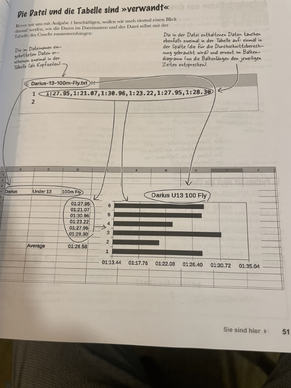

### Aufgaben / Challenges

###### 1. Daten aus Dateinamen extrahieren




````
fn = "Darius-13-100m-Fly.txt"

swimmer, age, distance, stroke = fn.removesuffix('.txt').split("-")

print(swimmer)
print(age)
print(distance)
print(stroke)

````
##### 2. Daten in der Datei verarbieten
#####Listendaten verarbeiten

- ziehen von Stoppzahlen aus Liste 
- umwandeln von strings in int
- umwandeln von minuten und sekund inhunederstel ---
- iteration über verschieden Stoppzeiten
- Durchschitt errechnen 
-  Rüchwandlung in str Minuten/ Sekunden
-  Ausgeben aller Werte
  

3. Lisen von Dateien
(Funktionen, Module und Dateien)